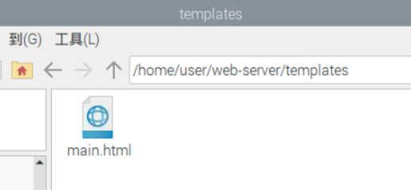
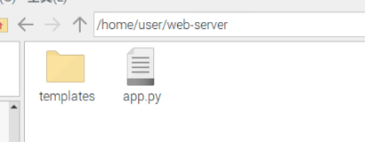
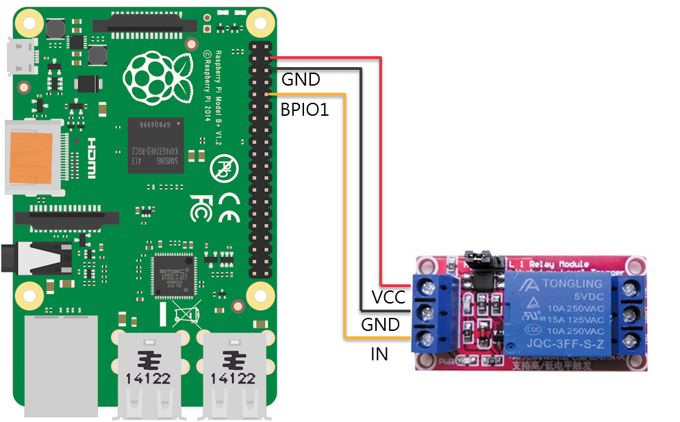
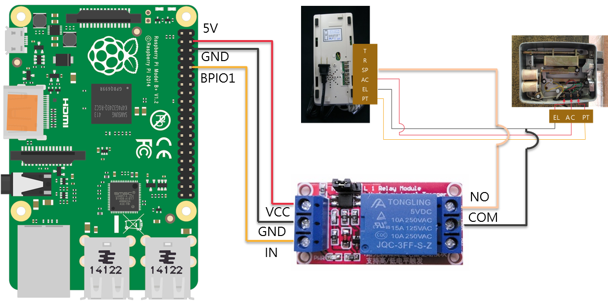
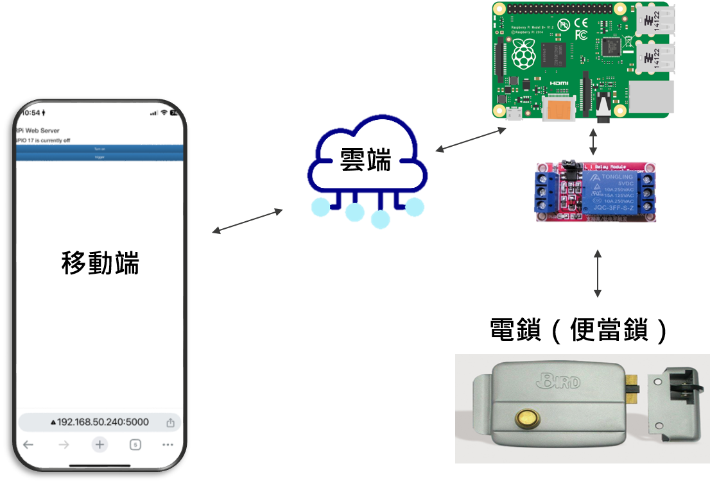

# 老公寓救星:遠端開鎖 RaspberryPiAutoLock
樹莓派連動電鎖教學

## 事前準備物品

| 物品           | 品牌           | 型號  |
| ------------- |:---------------------------:| ---------:|
| 樹莓派(Raspberry Pi) | 樹莓派基金會           | 4 Model B|
| 門口機/室內機         | 機智(明谷)            | MG-101AB|
| 電鎖(便當鎖)          | Bird 鳥牌            | LG001   |
| 1路5V繼電器模組       | 莆洋國際電子有限公司  |   1208   |

## 物品說明書
### [1路5V繼電器模組說明書](http://www.pu-yang.com.tw/download.html)
### [樹莓派針腳說明書](https://pinout.xyz/)

## 數莓派安裝軟體環境

### 1.安裝系統
[Raspberry Pi OS](https://www.raspberrypi.com/software/)
選擇相對應的系統安裝
### 2.安裝Web Server 
[Raspberry Pi Web Server using Flask to Control GPIOs](https://randomnerdtutorials.com/raspberry-pi-web-server-using-flask-to-control-gpios/)
建立基本Web功能
### 3.修改程式碼
修改部分程式碼，詳細程式碼請參考[Code資料夾](/code/)
```no-highlight
＊app.py:
修改成持續監聽port:5000

＊Main.html:
新增Trigger按鈕將電鎖短暫開門
```
Main.html檔案位置



app.py檔案位置


### 4.單元測試
將樹梅派串聯繼電器做電控測試



成功會會亮燈並有繼電器切換聲


## 門口機與電鎖接線
照圖施工，保證成功

## 改造電路

將門口機紅圈處電路新增接點已達到跳過門鈴按鈕功能


## 綜合應用
電路接線圖

移動端傳送訊息改變樹莓派腳位信號，輸出腳位信號改變，繼電器變位，電鎖線路導通



## Reference Link

[電鎖？！門鈴？！對講機狀況OUT！！｜明谷對講機故障狀況排除超詳細解說｜公寓門鈴不會響｜電鎖打不開｜成為弱電師傅的第一步【弱電通】](https://www.youtube.com/watch?v=n-X9EhQSdIs&t=803s)
[大門電鎖故障自己舊換新免煩惱！便當鎖安裝完整教學｜鳥牌Bird正反電鎖注意事項｜公寓大門門鎖、輔助鎖安裝更換｜可不可以鎖進去一點點就好?【弱電通】](https://www.youtube.com/watch?v=y_kV7PxyuJ4&t=1s)
[樹莓派控制一樓電控鎖大門 從此不用帶鑰匙](https://www.youtube.com/shorts/VHymbJ414KI)
